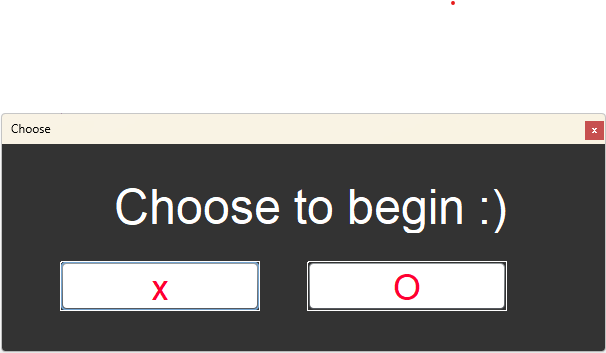
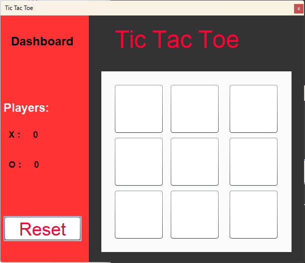
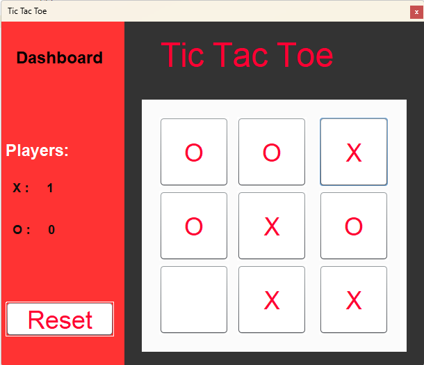
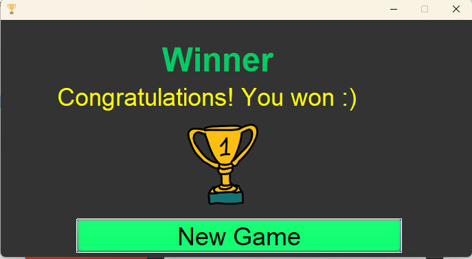

# TicTacToe-Spiel

Mit Java Swing entwickelt, bietet dieses TicTacToe-Spiel eine grafische Benutzeroberfläche und einen computergesteuerten Gegner, der derzeit die Minimax-Strategie verwendet. Zukünftige Erweiterungen sollen weitere Strategien einführen, um das Spiel noch herausfordernder zu gestalten. Diese Entwicklung zeigt nicht nur die Fähigkeit, klassische Spiele neu zu interpretieren, sondern auch, komplexe Algorithmen in unterhaltsame und interaktive Anwendungen zu integrieren.

## Spielansichten

### Spielstart Auswahl

Hier wählt der Spieler, ob er X oder O sein möchte, um das Spiel zu beginnen.

### Spielbrett

Das Spielbrett zeigt leere Felder zu Beginn des Spiels, auf denen die Spieler ihre X oder O setzen.

### Während des Spiels

Eine laufende Partie, bei der einige Felder bereits besetzt sind und die Entscheidungen der Spieler sichtbar werden.

### Gewinner Bildschirm

Der Gewinnerbildschirm wird angezeigt, wenn ein Spieler gewinnt, komplett mit einer Glückwunschmeldung.

## Wie man das Spiel startet

Um das TicTacToe-Spiel zu starten, folge diesen Schritten:

1. Klone das Repository.
2. Stelle sicher, dass Java auf deinem System installiert ist.
3. Kompiliere die Quelldateien mit `javac` oder einer IDE deiner Wahl.
4. Führe die kompilierte `.class`-Datei aus, um das Spiel zu starten.
